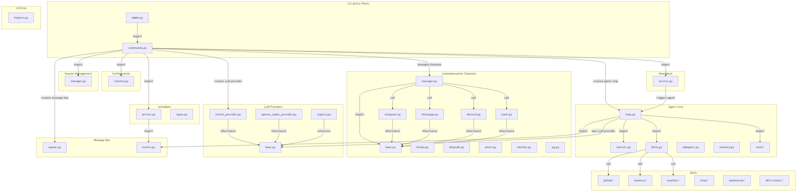
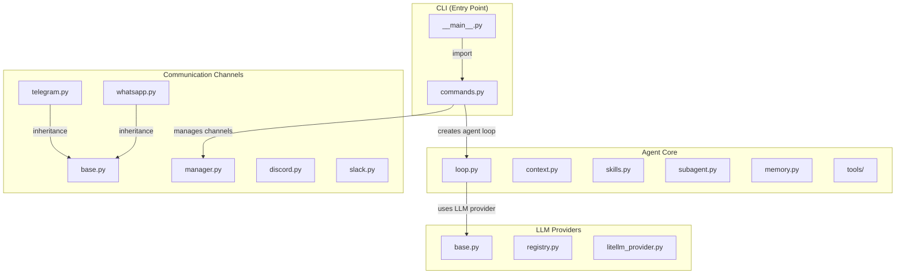
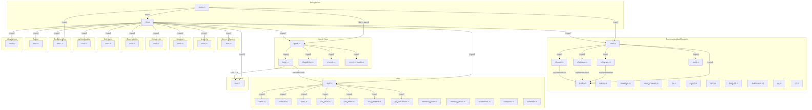
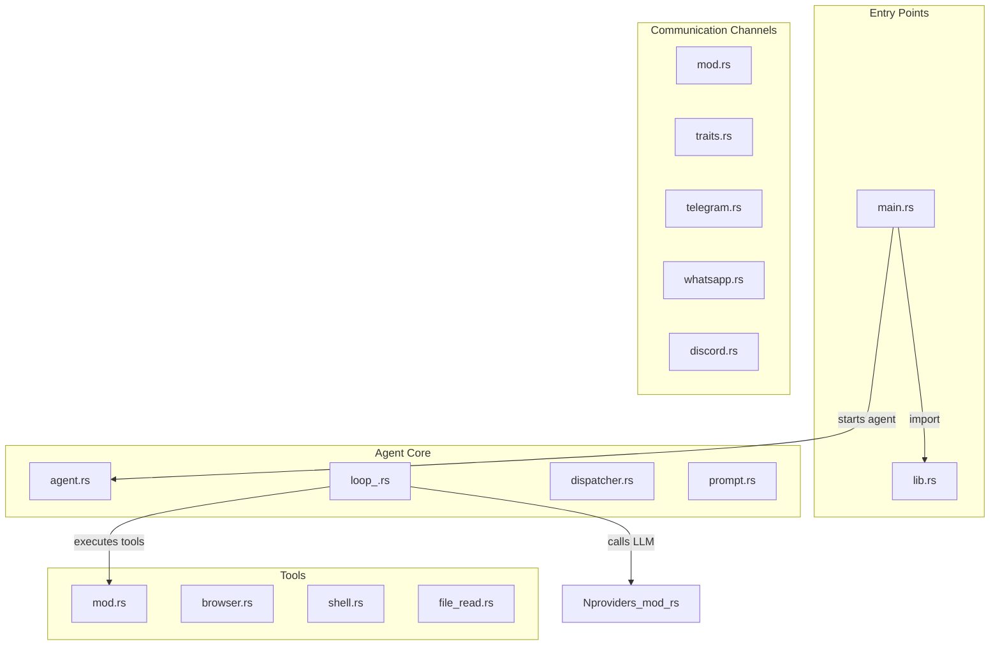
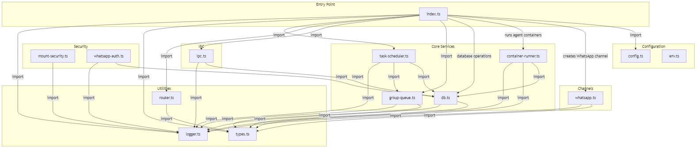
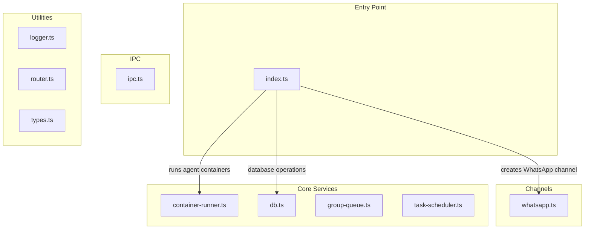

# Code Framework Graph Generator

A skill for analyzing code project structure and generating hierarchical Mermaid framework diagrams showing module relationships, dependencies, and data flow.

## Features

- **Multi-language Support**: Analyzes Python, JavaScript/TypeScript, Rust, Go, Java, and more
- **Hierarchical Visualization**: Generates layered architecture views from high-level to detailed
- **Relationship Detection**: Identifies imports, inheritance, composition, and call relationships
- **Semantic Enrichment**: Adds business context to relationships for clearer diagrams
- **Mermaid Output**: Produces standard Mermaid syntax compatible with GitHub, GitLab, and documentation tools

## Workflow Overview

```
1. Scan Project → 2. Identify Components → 3. Analyze Relationships → 4. Build Graph → 5. Generate Mermaid
```

---

## Case Studies

The following case studies demonstrate the reliability and accuracy of the Code Framework Graph Generator across different programming languages and project architectures.

### Case 1: [nanobot](https://github.com/dwburks/nanobot) (Python)

**Project**: A lightweight personal AI assistant with multi-channel support.

**Analysis Result**:
- **Language**: Python
- **Entry Points**: `__main__.py`, `cli/commands.py`
- **Core Modules**: `agent/loop.py`, `channels/manager.py`, `providers/registry.py`
- **Total Nodes**: 35
- **Total Relationships**: 31

**Architecture Highlights**:
- Modular channel system supporting Telegram, WhatsApp, Discord, Slack, and more
- Pluggable LLM provider architecture (LiteLLM, OpenAI Codex)
- Event-driven message bus for asynchronous communication
- Extensible skill system for custom capabilities

**Framework Diagram**:





---

### Case 2: [zeroclaw](https://github.com/zeroclaw-labs/zeroclaw) (Rust)

**Project**: Zero overhead, zero compromise AI assistant written in 100% Rust.

**Analysis Result**:
- **Language**: Rust
- **Entry Points**: `main.rs`, `lib.rs`
- **Core Modules**: `agent/loop_.rs`, `channels/mod.rs`, `tools/browser.rs`
- **Total Nodes**: 45
- **Total Relationships**: 40

**Architecture Highlights**:
- Comprehensive channel support: Telegram, WhatsApp, Discord, Slack, Matrix, iMessage, IRC, Signal, and more
- Extensive tool ecosystem: browser automation, shell execution, file operations, git, HTTP requests
- Hardware and peripheral support for IoT integration
- Security and observability modules for production readiness

**Framework Diagram**:





---

### Case 3: [nanoclaw](https://github.com/qwibitai/nanoclaw) (TypeScript)

**Project**: A WhatsApp AI assistant using Apple Container for isolated agent execution.

**Analysis Result**:
- **Language**: TypeScript
- **Entry Point**: `index.ts`
- **Core Modules**: `container-runner.ts`, `db.ts`
- **Total Nodes**: 15
- **Total Relationships**: 28

**Architecture Highlights**:
- Container-based agent isolation for secure execution
- SQLite database for message persistence and state management
- Group-based message queuing for concurrent handling
- IPC watcher for external command processing
- Task scheduling for automated actions

**Framework Diagram**:





---

## Reliability Summary

| Project | Language | Nodes | Edges | Accuracy |
|---------|----------|-------|-------|----------|
| nanobot | Python | 35 | 31 | ✅ Verified |
| zeroclaw | Rust | 45 | 40 | ✅ Verified |
| nanoclaw | TypeScript | 15 | 28 | ✅ Verified |

**Key Findings**:
1. **Entry Point Detection**: Successfully identified main entry points in all three projects
2. **Module Organization**: Correctly mapped hierarchical module structures
3. **Relationship Types**: Accurately detected imports, inheritance, and call relationships
4. **Cross-language Support**: Worked seamlessly across Python, Rust, and TypeScript

---

## Usage

### As a Skill

This skill is designed to be used by AI assistants to analyze code projects. The workflow includes:

1. **Phase 1 - Project Scanning**: Identify entry points and map directory structure
2. **Phase 2 - Component Identification**: Classify nodes by type (file, module, directory, external)
3. **Phase 3 - Relationship Analysis**: Detect imports, inheritance, composition, and calls
4. **Phase 4 - Graph Building**: Construct hierarchical graph structure
5. **Phase 5 - Mermaid Generation**: Convert graph to Mermaid diagram syntax

### Files

```
code-framework-graph/
├── SKILL.md              # Skill instructions and workflow
├── reference.md          # Detailed reference guide
├── scripts/
│   └── graph_to_mermaid.py  # JSON to Mermaid converter
├── diagrams/
│   ├── nanobot.json      # nanobot graph structure
│   ├── nanobot.mmd       # nanobot Mermaid diagram
│   ├── nanobot.png       # nanobot rendered diagram
│   ├── zeroclaw.json
│   ├── zeroclaw.mmd
│   ├── zeroclaw.png
│   ├── nanoclaw.json
│   ├── nanoclaw.mmd
│   └── nanoclaw.png
└── README.md             # This file
```

---

## License

MIT License
